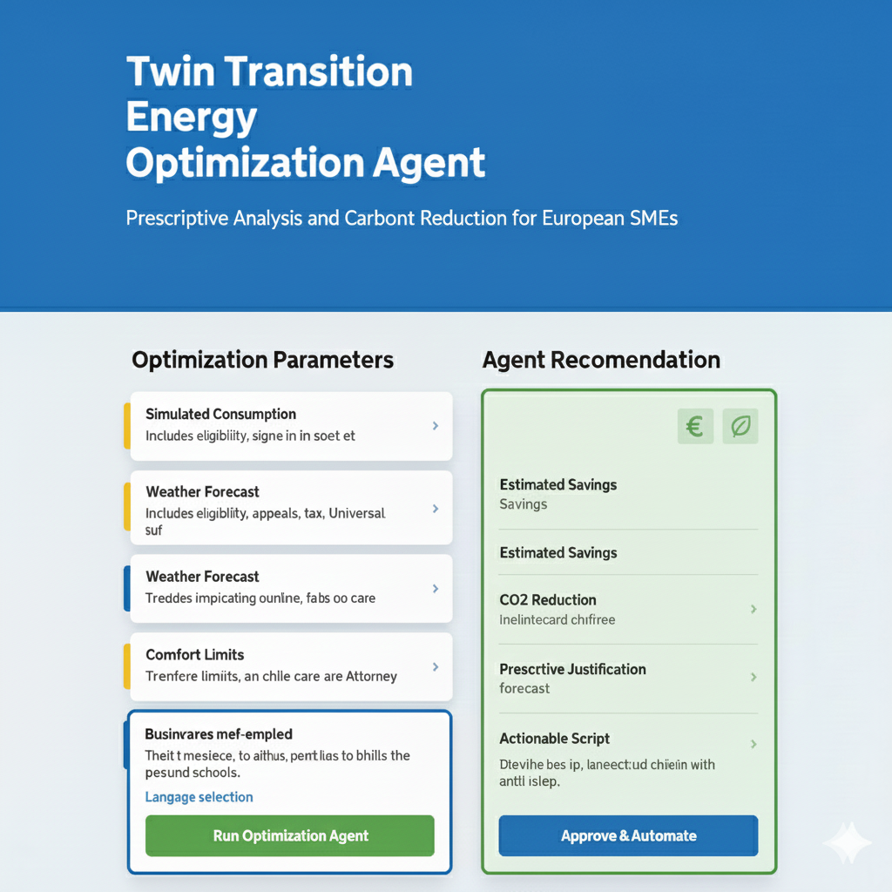
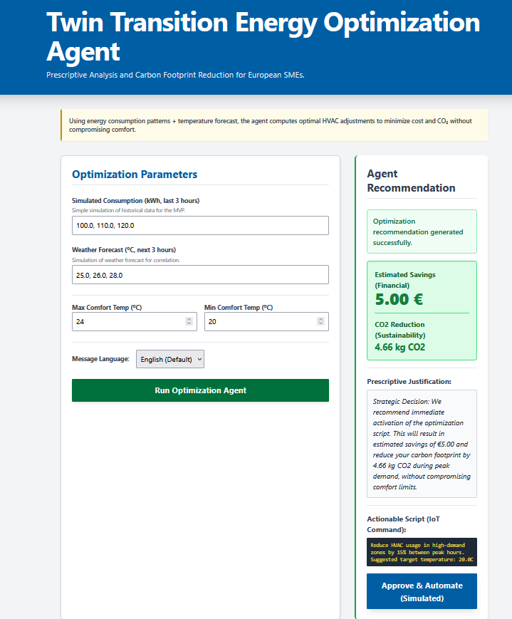
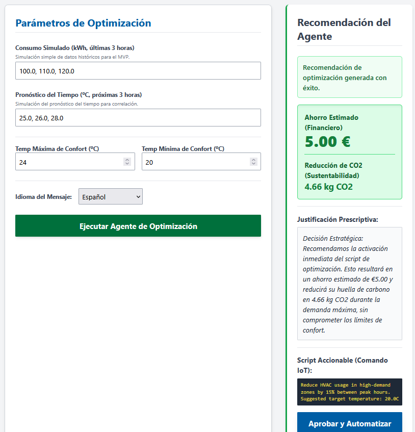
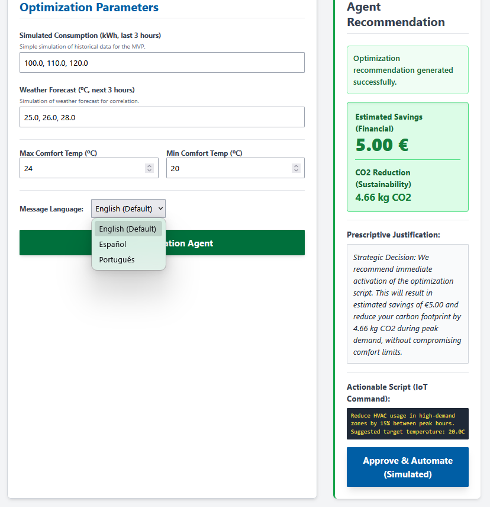
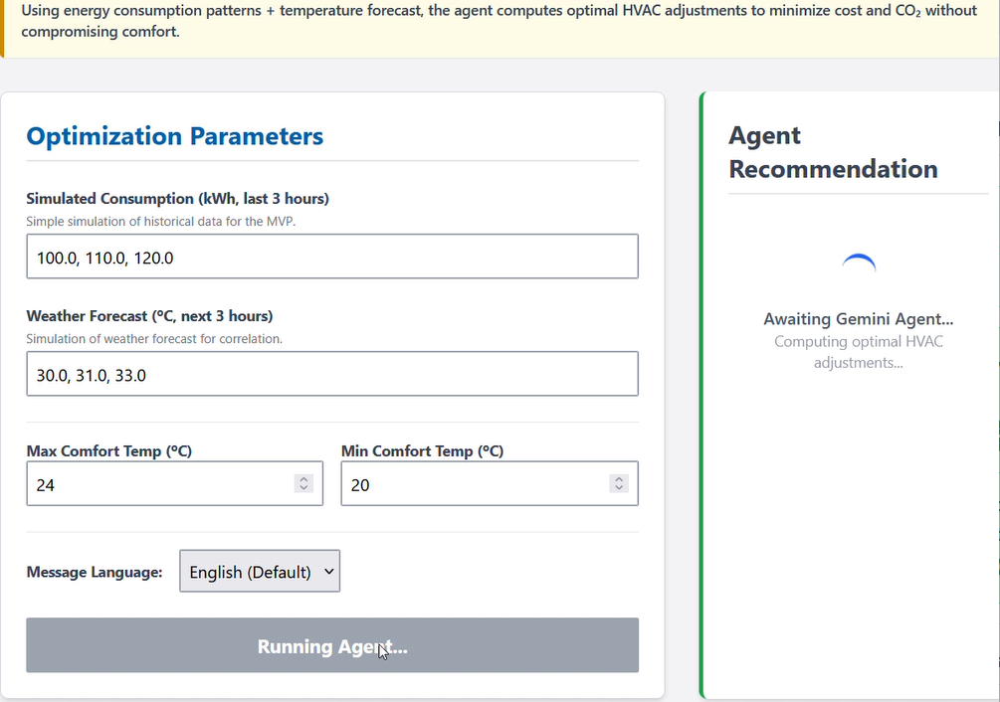

# 🚀 Twin Transition Energy Optimization Agent (MVP)  

**AI-Powered Prescriptive Energy Management for European SMEs – Digital + Green Transition in One Click**

   

The **Twin Transition Energy Optimization Agent** is a modular platform designed to analyze, forecast, and optimize energy consumption in industrial and building environments. It combines a Spring Boot backend, a dedicated simulation engine, and an AI-powered analysis layer to produce actionable insights and support real-time decision making.

---

## Project Overview

This system monitors energy usage, evaluates optimization scenarios, and generates technical recommendations.  
The architecture is cleanly separated into independent modules so the platform can scale, evolve, or integrate with external systems without major restructuring.

**Core capabilities include:**

- Real-time data ingestion and normalization  
- Simulation of optimization strategies (load shifting, peak shaving, baseline deviation, etc.)  
- Anomaly detection and alerting  
- Automated technical reporting using a generative AI service  
- REST APIs designed for integration with dashboards or external services  

---

## Technical Architecture 

| Layer | Technologies | Description |
|-------|--------------|-------------|
| **Application Core** | Spring Boot 3, Java 17 | Main agent logic, REST services, process orchestration |
| **Optimization Engine** | Custom algorithms, mathematical models | Runs simulations and computes efficiency scenarios |
| **AI Analysis Layer** | Gemini API | Produces contextual summaries and recommendations |
| **Persistence Layer** | PostgreSQL, JPA | Stores historical data, results, and metrics |
| **Observability** | Spring Actuator, structured logs | Health monitoring and diagnostics |

The system follows a domain-centric structure, ensuring business rules remain isolated from infrastructure details.

---

## Primary Features

- Data acquisition and standardization  
- Forecasting and scenario simulation  
- Pattern-based anomaly detection  
- Automated analytical reports  
- Modular API endpoints for integration  
- Domain-driven structure with clean separation of concerns  

---

## Why This Architecture

This project was built to demonstrate:

- Strong software architecture fundamentals (DDD, modularity, clean layering)  
- Practical integration of generative AI into engineering workflows  
- Scalability for future microservices or edge deployments  
- Clear, maintainable Java/Spring Boot code suitable for production environments  
- A realistic use-case where simulations, analytics, and automation converge  

⭐⭐⭐⭐⭐ Star this repo if you believe Europe needs more agents like this.

---

👤 Author

### Fernando Silva 

Software Engineer | Java & Angular Specialist | AI Enthusiast

LinkedIn https://www.linkedin.com/in/fernando-silva-83b155a4/

Email: fernandusilva84@gmail.com

© 2025 Twin Transition Energy Optimization Agent. All rights reserved.

